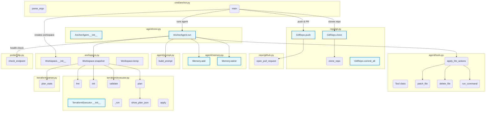

# Anchor – Code-base Map

Below is a high-level call-graph of the current MVP implementation.  Each subgraph groups related functions/classes by module; primary call-edges between modules are shown so you can trace an execution path from the CLI down to Terraform operations and back.

> Tip: Open this file in a Markdown viewer with Mermaid support (e.g. VS Code with "Markdown: Open Preview") to explore the interactive diagram. 

## Key Implementation Notes

### Docker Deployment
- `Dockerfile` creates a container with Terraform, Terraformer, and all Python dependencies
- `docker-compose.yml` provides easy orchestration with environment variable management
- AWS provider is pre-downloaded during image build for faster startup

### Debug Logging
- Set `LOG_LEVEL=DEBUG` to see full LLM prompts, responses, and tool executions
- Agent logs all workspace snapshots and intermediate states
- Terraform command outputs are captured and logged

### Terraformer Integration
- Runs inside Docker container with consistent Linux environment
- Falls back to creating minimal `main.tf` if import fails
- Credentials are passed via environment variables (SRC_* for discovery, DEST_* for deployment)

### Agent Loop
- Iterates up to `--max-iters` times (default 20)
- Each iteration:
  1. Snapshots workspace state (fmt, validate, plan)
  2. Builds prompt with recent observations
  3. Calls LLM with available tools
  4. Executes returned tool calls
  5. Checks for completion
- Memory buffer keeps last 50 observations for context

## Recent Improvements

- **Module/Directory Name Handling**: All module and directory names are now stripped of trailing spaces, preventing Terraform validation errors.
- **Centralized Configuration**: All configuration defaults (AWS region, branch, log level, max iterations, AWS services for Terraformer, etc.) are now defined in `anchor/constants.py`.
- **Improved Error Handling**: The system now provides clear error messages for invalid AWS credentials, OpenAI API key issues, and module directory problems.

## Troubleshooting

- **Invalid AWS Credentials**: Check your environment variables or `.env.local` for correct AWS keys if you see credential errors.
- **OpenAI API Key Error**: Ensure your `OPENAI_API_KEY` is valid if you see authentication errors.
- **Module Directory Errors**: If you see errors about unreadable module directories, check for valid credentials and resources in the source account.

## Maintainability

- All defaults and service lists are now in `anchor/constants.py` for a single source of truth.
- The agent and Terraformer reference these constants, reducing duplication and improving maintainability.