# Anchor – Code-base Map

Below is a high-level call-graph of the current MVP implementation.  Each subgraph groups related functions/classes by module; primary call-edges between modules are shown so you can trace an execution path from the CLI down to Terraform operations and back.

```mermaid
flowchart TD
    %% ============== cmd layer ==========
    subgraph cmd/anchor.py
        A1(parse_args)
        A2(main)
    end

    %% ============== repo helpers ==========
    classDef cls fill:#e6f7ff,stroke:#007acc,stroke-width:2;

    subgraph repo/git.py
        RG1(clone_repo)
        RG2[GitRepo.clone]
        RG3[GitRepo.commit_all]
        RG4[GitRepo.push]
    end

    %% apply class styles
    class RG2,RG3,RG4 cls;

    subgraph repo/github.py
        GH1(open_pull_request)
    end

    %% ============== workspace ==========
    subgraph workspace.py
        WS1[Workspace.__init__]
        WS2[Workspace.snapshot]
        WS3[Workspace.temp]
        WS4[Workspace._get_directory_structure]
        WS5[Workspace._get_main_tf_content]
    end
    class WS1,WS2,WS3,WS4,WS5 cls;

    %% ============== agent ==========
    subgraph agent/core.py
        AG1[AnchorAgent.__init__]
        AG2[AnchorAgent.run]
    end
    class AG1,AG2 cls;

    subgraph agent/memory.py
        M1[Memory.add]
        M2[Memory.latest]
    end
    class M1,M2 cls;

    subgraph agent/prompt.py
        P1(build_prompt)
    end

    subgraph agent/tools.py
        T0(Tool class)
        T1(patch_file)
        T2(delete_file)
        T3(run_command)
        T4(apply_llm_actions)
    end

    %% ============== terraform layer ==========
    subgraph terraform/executor.py
        TE1[TerraformExecutor.__init__]
        TE2(_run)
        TE3(fmt)
        TE4(init)
        TE5(validate)
        TE6(plan)
        TE7(show_plan_json)
        TE8(apply)
    end
    class TE1 cls;

    subgraph terraform/parser.py
        PS1(plan_stats)
    end

    subgraph terraform/precheck.py
        PC1(validate_aws_credentials)
        PC2(validate_terraform_config)
    end

    %% ============== constants ==========
    subgraph constants.py
        C1[DEFAULT_MAX_ITERATIONS]
        C2[DEFAULT_MODEL]
        C3[DEFAULT_MEMORY_ITEMS]
        C4[DEFAULT_AGENT_SLEEP]
        C5[AWS_SERVICES]
    end

    %% ==== primary call edges =====
    A2 -->|clones repo| RG2
    A2 -->|creates workspace| WS1
    A2 -->|runs agent| AG2
    RG2 --> RG1
    AG2 --> M1
    AG2 --> M2
    AG2 --> P1
    AG2 --> WS2
    AG2 --> T4
    WS2 --> WS4
    WS2 --> WS5
    WS2 --> TE3
    WS2 --> TE4
    WS2 --> TE5
    WS2 --> TE6
    TE6 --> TE7
    WS2 --> PS1
    T4 --> T1
    T4 --> T2
    T4 --> T3
    A2 -->|push & PR| RG4 --> GH1

    %% ==== configuration edges =====
    AG1 -->|uses| C1
    AG1 -->|uses| C2
    AG1 -->|uses| C3
    AG2 -->|uses| C4
    PC1 -->|uses| C5

    %% legend
    classDef note fill:#fffaf0,stroke:#999,stroke-dasharray: 5 5;
```

> Tip: Open this file in a Markdown viewer with Mermaid support (e.g. VS Code with "Markdown: Open Preview") to explore the interactive diagram. 

## Key Implementation Notes

### Core Components

1. **AnchorAgent**
   - Manages the autonomous loop for Terraform deployment
   - Uses OpenAI's API for decision making
   - Maintains state through Memory class
   - Configurable via constants (iterations, model, memory size)

2. **Workspace**
   - Manages the physical Terraform code location
   - Provides directory structure and file content context
   - Handles Terraform command execution through TerraformExecutor
   - Supports temporary workspace creation for testing

3. **Memory**
   - Maintains a buffer of recent observations
   - Configurable size via DEFAULT_MEMORY_ITEMS
   - Used to provide context for LLM decisions

4. **Constants**
   - Centralized configuration in `constants.py`
   - Defines defaults for:
     - Agent behavior (iterations, sleep time)
     - LLM configuration (model, memory size)
     - AWS services for Terraformer
     - Logging levels

### Docker Deployment
- `Dockerfile` creates a container with Terraform, Terraformer, and all Python dependencies
- `docker-compose.yml` provides easy orchestration with environment variable management
- AWS provider is pre-downloaded during image build for faster startup

### Debug Logging
- Set `LOG_LEVEL=DEBUG` to see full LLM prompts, responses, and tool executions
- Agent logs all workspace snapshots and intermediate states
- Terraform command outputs are captured and logged

### Terraformer Integration
- Runs inside Docker container with consistent Linux environment
- Falls back to creating minimal `main.tf` if import fails
- Credentials are passed via environment variables (SRC_* for discovery, DEST_* for deployment)

### Agent Loop
- Iterates up to `DEFAULT_MAX_ITERATIONS` times
- Each iteration:
  1. Snapshots workspace state (fmt, validate, plan)
  2. Captures directory structure and main.tf content
  3. Builds prompt with recent observations from memory
  4. Calls LLM with available tools
  5. Executes returned tool calls
  6. Checks for completion
  7. Sleeps for `DEFAULT_AGENT_SLEEP` seconds
- Memory buffer keeps last N observations for context (configurable)

## Recent Improvements

- **Module/Directory Name Handling**: All module and directory names are now stripped of trailing spaces, preventing Terraform validation errors.
- **Centralized Configuration**: All configuration defaults are now defined in `constants.py`.
- **Improved Error Handling**: Clear error messages for invalid AWS credentials, OpenAI API key issues, and module directory problems.
- **Enhanced Context**: Workspace snapshots now include directory structure and main.tf content for better LLM decision making.

## Troubleshooting

- **Invalid AWS Credentials**: Check your environment variables or `.env.local` for correct AWS keys if you see credential errors.
- **OpenAI API Key Error**: Ensure your `OPENAI_API_KEY` is valid if you see authentication errors.
- **Module Directory Errors**: If you see errors about unreadable module directories, check for valid credentials and resources in the source account.
- **Memory Issues**: If the agent seems to lose context, check the `DEFAULT_MEMORY_ITEMS` setting in `constants.py`.

## Maintainability

- All defaults and service lists are now in `constants.py` for a single source of truth.
- The agent and Terraformer reference these constants, reducing duplication and improving maintainability.
- Clear separation of concerns between components:
  - Agent handles decision making
  - Workspace manages file operations
  - Memory maintains context
  - Tools execute actions
  - Constants provide configuration